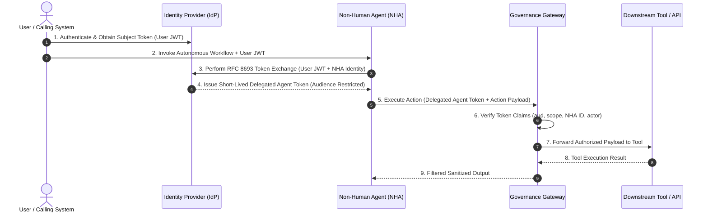

# Pillar 01: Identity & Non-Human Agent (NHA) Authentication

---

## Overview

The transition from traditional user-centric identity to **Non-Human Agent (NHA)** identity represents one of the most critical paradigm shifts in enterprise AI security. Unlike static service accounts or long-lived API keys, autonomous agents execute workflows asynchronously, delegate tasks across subagents, and interact with external services on behalf of human users.

Pillar 01 establishes standard patterns for:
1. **Cryptographic Workload Identity**: Assigning verifiable, SPIFFE-based or OAuth 2.0 Client Credential identities to autonomous agent instances.
2. **Short-Lived Delegated Tokens**: Enforcing strict TTLs (e.g., 5-15 minutes) for token exchange.
3. **Impersonation vs. Delegation**: Distinguishing between an agent acting *as* a user versus an agent acting *on behalf of* a user with constrained scope.
4. **Context Propagation & Audience Binding**: Ensuring access tokens issued to an NHA cannot be replayed across unauthorized downstream services.

---

## Threat Model: Non-Human Agent Identity

| Threat Vector | Description | Governance Mitigation |
| :--- | :--- | :--- |
| **Token Hijacking & Replay** | Intercepted agent access tokens used against unintended microservices. | Strict `aud` (Audience) binding & short token lifetimes (< 15 mins). |
| **Over-Privileged Delegation** | Agent inherits full admin permissions of the invoking human user. | RFC 8693 Token Exchange with downscoped `scope` request. |
| **Confused Deputy Problem** | Malicious prompt tricks agent into calling downstream tools using legitimate tokens. | Identity-linked policy enforcement at execution gateway. |
| **Orphaned NHA Session** | Long-running agent process continues executing after user session is revoked. | Real-time token revocation check via OAuth Introspection / JWT revocation lists. |

---

## Architecture Diagram

---

## Detailed Specifications

- [RFC 8693 Token Exchange Deep Dive](2026-07-27-token-exchange-rfc8693.md)
- [NHA Identity Infographic](assets/2026-07-27-nha-infographic.png)
- [🎥 Watch NHA Identity Flow Video Animation](https://github.com/jitu028/enterprise-agent-governance-framework/releases/download/media-assets/2026-07-27-nha-animation.mp4)
