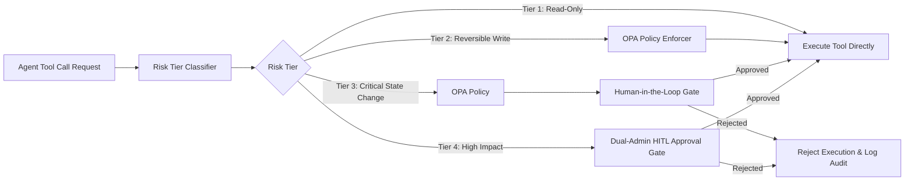

# Pillar 02: Policy & Action Boundaries

[](#)
[](2026-07-28-4-tier-risk-classification.md)

---

## Overview

Autonomous agents are capable of calling external functions, modifying database records, sending communications, and initiating financial or infrastructure transactions. Without strict action boundaries, an agent encountering unexpected input or prompt injection could execute harmful operations.

Pillar 02 defines the **Policy & Action Boundaries** engine, covering:
1. **4-Tier Risk Classification**: Categorizing agent tool calls into deterministic risk tiers based on state impact, reversibility, and target criticality.
2. **OPA / Rego Enforcers**: Declarative policy rules evaluated before tool execution.
3. **Human-in-the-Loop (HITL) Interceptors**: Mandatory approval workflows for high-risk or irreversible state changes.
4. **Dynamic Context Limits**: Enforcing rate bounds, spending caps, and bulk operation limits.

---

## The 4-Tier Action Boundary Model

```
+-----------------------------------------------------------------------+
|  Tier 4: Autonomous High-Impact (Multi-system Admin / Destructive)     |
|  -> Requires Dual Human Authorization + Multi-Factor Approval         |
+-----------------------------------------------------------------------+
|  Tier 3: Critical State Change (Financial / PII Modification / Wire)  |
|  -> Requires Single Human-in-the-Loop (HITL) Explicit Approval        |
+-----------------------------------------------------------------------+
|  Tier 2: Reversible Write (Draft creation / Low-impact updates)       |
|  -> Automated Approval + Asynchronous Audit Log & Real-time Alert     |
+-----------------------------------------------------------------------+
|  Tier 1: Read-Only / Grounded Query (RAG search / Data retrieval)     |
|  -> Fully Autonomous Execution with Egress Rate Limits                |
+-----------------------------------------------------------------------+
```

---

## Threat Model: Action Boundaries

| Threat Vector | Description | Governance Mitigation |
| :--- | :--- | :--- |
| **Privilege Escalation via Tool Call** | Agent attempts to invoke an administrative API tool outside its prompt context. | OPA policy check comparing agent risk tier against endpoint registry. |
| **Bulk Data Exfiltration** | Agent calls read tool in a loop to export thousands of sensitive records. | Dynamic payload volume limits and threshold alerts. |
| **Unintended State Destruction** | Agent deletes database records due to ambiguous user instructions. | Classify `DELETE` actions as Tier 3/4 requiring explicit HITL approval. |
| **Prompt Injection Payload Manipulation** | Injected text modifies tool call arguments (e.g., changing recipient account). | Schema verification and value sanitization before OPA policy evaluation. |

---

## Policy Architecture Diagram



---

## Detailed Specifications

- [4-Tier Risk Classification Framework](2026-07-28-4-tier-risk-classification.md)
- [Boundary Architecture Infographic](assets/2026-07-28-boundary-infographic.png)
- [🎥 Watch Action Boundary Evaluation Video Animation](https://github.com/jitu028/enterprise-agent-governance-framework/releases/download/media-assets/2026-07-28-boundary-animation.mp4)
