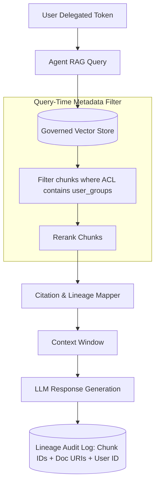

# Pillar 04: Data Context & RAG Lineage

---

## Overview

Retrieval-Augmented Generation (RAG) and long-term memory vector stores introduce significant data governance challenges. An agent query might synthesize snippets from multiple confidential documents, bypassing traditional document-level Access Control Lists (ACLs).

Pillar 04 establishes standards for:
1. **Document-Level ACL Synchronization**: Ensuring vector embeddings inherit and respect source document permissions in real time.
2. **Citation & Grounding Lineage**: Tracking exact vector chunk IDs, source document URIs, and confidence scores for every RAG response.
3. **Data Loss Prevention (DLP) for Context**: Scrubbing PII/PHI and secret tokens prior to vector indexing and LLM prompt construction.
4. **Vector Store Authorization Guards**: Query-time metadata filtering based on the calling user's Delegated NHA token claims.

---

## RAG Lineage Architecture

---

## Core Guidelines

1. **Embedding Pipeline Scrubbing**: Raw files ingested into vector databases must pass through automated DLP filters before chunking.
2. **Metadata-Enforced Access Control**: Every vector chunk metadata object must include an `allowed_groups` array. Vector similarity searches MUST include `allowed_groups CONTAINS user_group` in the filter clause.
3. **Grounding Lineage Record**: Every generated response must preserve a JSON manifest listing source document URIs, chunk hashes, and similarity distance scores.
