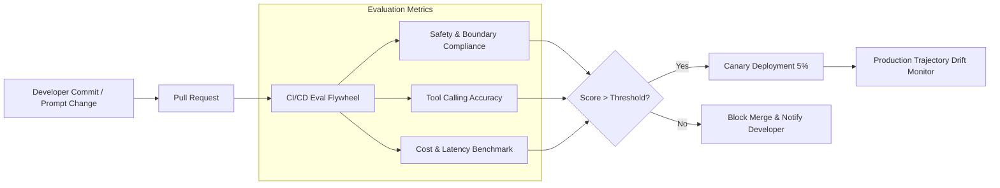

# Pillar 06: Lifecycle, DevOps & Multi-Agent Mesh

---

## Overview

Deploying autonomous agents into production requires CI/CD pipelines adapted for non-deterministic software. Traditional unit testing must be supplemented with evaluation flywheels (evalsets), behavioral regression detection, canary rollouts, and multi-agent protocol governance.

Pillar 06 specifies:
1. **Continuous Evaluation (Eval) Flywheels**: Automated evaluation of agent trajectories against benchmark golden datasets prior to deployment.
2. **Behavioral Drift & Regression Gateways**: Monitoring production trajectory accuracy and safety scores over time.
3. **Multi-Agent Protocol Safety (A2A Communication)**: Contract definitions and authentication between communicating peer agents in a mesh.
4. **Agent Versioning & Blue-Green Rollouts**: Controlled canary deployment strategies for new agent system prompts and tool bindings.

---

## CI/CD Agent Evaluation Lifecycle

---

## Multi-Agent Communication Governance

1. **Explicit Protocol Contracts**: Subagent interactions MUST follow strict JSON-schema or gRPC service contracts.
2. **Mutual Agent Authentication (mTLS / A2A)**: Subagents verifying peer identity before exchanging messages or executing delegated tool sub-routines.
3. **Recursion Guard**: Circuit breaker imposing maximum depth limits (e.g., max 3 subagent delegation levels) to prevent infinite multi-agent feedback loops.
