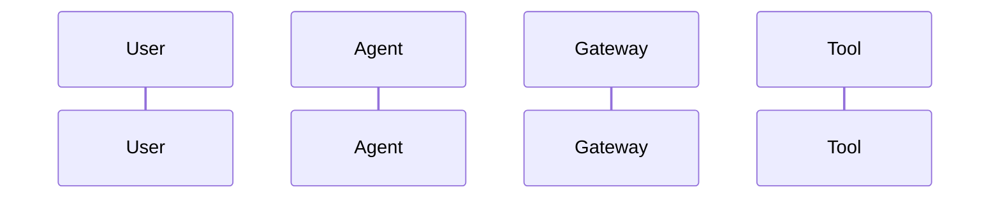

# Building Governed AI Agents: [Topic Breakdown]

## Introduction

As developers, we are moving fast from building chat interfaces to deploying autonomous **Non-Human Agents (NHAs)** capable of calling APIs and executing multi-step tasks.

In this article, we break down how to implement **[Governance Domain]** using open standards and production-ready patterns.

---

## The Architecture

Here is the high-level workflow:



---

## Step-by-Step Code Walkthrough

### 1. Defining the Spec

```python
# Sample Python or TypeScript Implementation
```

### 2. Enforcing Boundary Rules

```yaml
# Configuration or Policy YAML
```

---

## Production Benchmarks & Edge Cases

- **Performance Overhead**: < 5ms gateway latency.
- **Fail-Closed Behavior**: If policy service is unreachable, execution halts automatically.

---

## Conclusion & Resources

- GitHub Repo: [Enterprise Agent Governance Framework](https://github.com/jitu028/enterprise-agent-governance-framework)
- Specification Link: [Pillar Reference](https://github.com/jitu028/enterprise-agent-governance-framework/tree/main/pillars)
