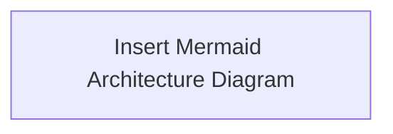

# [Title]: Enterprise Agent Governance Framework - [Domain Name]

**Subtitle**: Standardizing [Topic] for Autonomous Non-Human Agents in Enterprise Architecture

---

## Executive Summary

[Provide a 2-3 paragraph overview of the architectural challenge, business impact, and governance solution.]

---

## The Core Governance Challenge

- **Legacy Problem**: [Explain why traditional controls fail for AI agents.]
- **Security & Operational Risk**: [Detail attack vectors like prompt injection, privilege escalation, or orphan execution.]

---

## Architectural Deep Dive



### Key Technical Control Points
1. **Control 1**: [Description]
2. **Control 2**: [Description]
3. **Control 3**: [Description]

---

## Code / Policy Implementation Example

```rego
# Reference OPA Rego or JSON Schema Example
package enterprise.agent.governance
```

---

## Governance Checklist for CISOs & Enterprise Architects

- [ ] Control Point A Verified
- [ ] Control Point B Implemented
- [ ] Control Point C Audited

---

*Published under the [Enterprise Agent Governance Framework (EAGF)](https://github.com/jitu028/enterprise-agent-governance-framework).*
